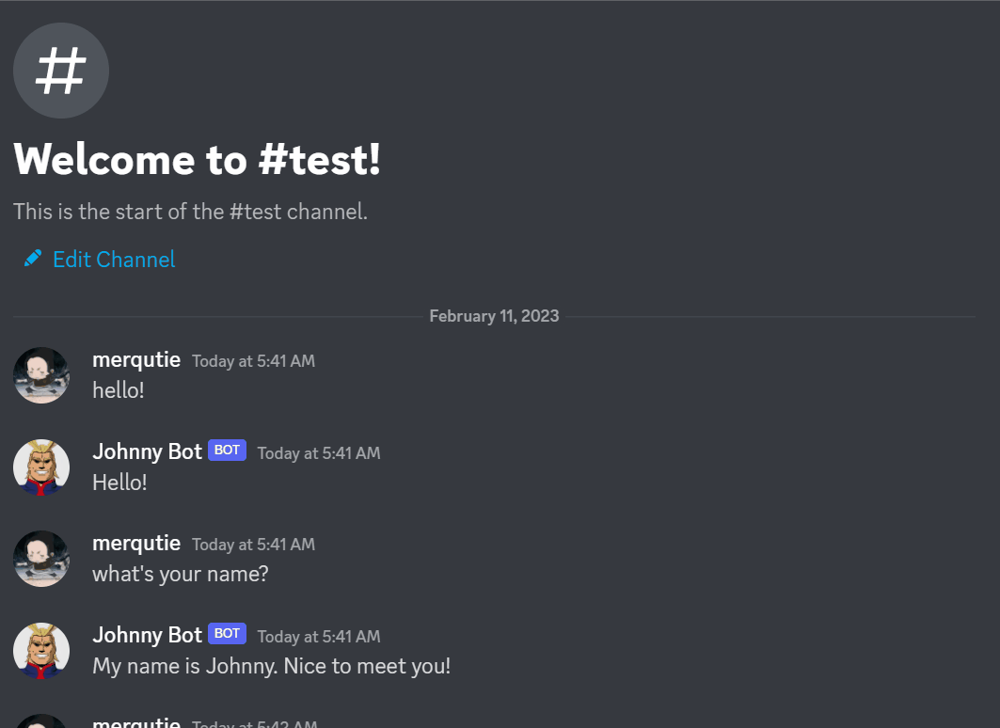

# Johnny Discord Bot
This program is a discord chat bot called Johnny. It can answer some personal questions, tell trivias, tell quotes from famous authors, or humor users with jokes or pickup lines. Johnny can also tell the weather in a city, just make sure to add the word 'weather' to input, and make the city name be the last word in the message. 

## Preview

## Data Structures Used
Johnny uses a message probability system for generating accurate responses. The probability is derived from comparing user input transformed into list with a list of keywords that corresponds to a specific bot response. Then it utilizes python dictionary to document the response with its corresponding probability in a key-value pair, then it matches the response with highest probability and returns it. 

Lists were also used to form a collection of strings for random requests like, saying a pickup line, joke or trivia. Then I incorporated APIs for the weather fetching and generating of quotes.

## Personal Modifications from Reference Code
My modifications from the reference code includes the bot response for personal questions. Bot being able to tell a random quote, joke, trivia, or pickup line. I also incorporated a previous project weather fetcher and integrated the code to enable the bot to fetch weather in a city. Lastly, I made the bot integrate into Discord, a messaging app, and function as a chat bot. 

## References
Base Code:  
Indently - [How to create an accurate Chat Bot Response System in Python Tutorial (2021)](https://www.youtube.com/watch?v=Ea9jgBjQxEs&ab_channel=Indently)
 

Learning to make a Discord Bot:  
Idently - [Creating a Discord Bot in Python 3.9 ](https://www.youtube.com/watch?v=fU-kWx-OYvE&ab_channel=Indently)
 